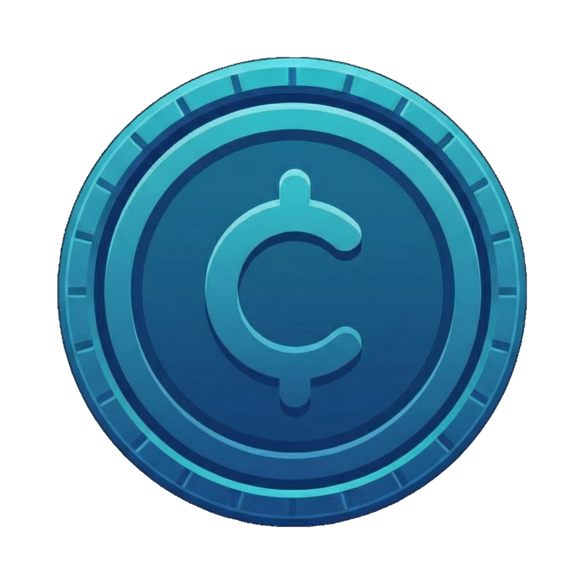

#  Spendy

A modern, multilingual transaction tracking application built with Next.js 14, Convex, and Tailwind CSS. Track your expenses and income with a beautiful, responsive UI that works on desktop and mobile (PWA enabled).

## Features

- **Transaction Management**: Create, update, and delete expense/income records
- **Custom Categories**: Personalized emoji-based categories with multilingual support (English/Chinese)
- **Statistics Dashboard**: Visual analytics with charts showing spending patterns
- **Multi-language Support**: i18n with English and Chinese interfaces
- **Google OAuth**: Secure authentication via NextAuth.js v5
- **PWA Support**: Progressive Web App capabilities for mobile installation
- **External API**: REST API endpoint for third-party integrations (iOS Shortcuts support)
- **API Token Authentication**: Secure token-based access for external integrations
- **Dark Mode**: Automatic dark mode support via Tailwind CSS
- **Responsive Design**: Mobile-first design with Tailwind CSS

## Tech Stack

- **Framework**: [Next.js 14.2+](https://nextjs.org/) (App Router)
- **Language**: [TypeScript 5.4+](https://www.typescriptlang.org/) (Strict mode)
- **Backend**: [Convex](https://convex.dev/) (Serverless database + real-time functions)
- **Authentication**: [NextAuth.js v5](https://next-auth.js.org/) with Google OAuth
- **Styling**: [Tailwind CSS 3.4+](https://tailwindcss.com/)
- **Charts**: [Recharts](https://recharts.org/)
- **Icons**: [Lucide React](https://lucide.dev/)
- **i18n**: [next-intl](https://next-intl-docs.vercel.app/)
- **Testing**: [Vitest](https://vitest.dev/) (unit), [Playwright](https://playwright.dev/) (e2e)
- **PWA**: [next-pwa](https://github.com/shadowwalker/next-pwa)

## Quick Start

### Prerequisites

- [Node.js](https://nodejs.org/) 18+ or [Bun](https://bun.sh/)
- [Convex](https://convex.dev/) account
- [Google Cloud](https://console.cloud.google.com/) project with OAuth 2.0 credentials

### Setup

1. **Clone and install dependencies**:

   ```bash
   git clone <repository-url>
   cd spendy
   bun install
   ```

2. **Configure environment variables**:

   ```bash
   cp .env.example .env.local
   ```

   Edit `.env.local` with your credentials:
   - Get Convex values from [Convex Dashboard](https://dashboard.convex.dev/)
   - Generate secrets: `openssl rand -base64 32`
   - Set up Google OAuth in [Google Cloud Console](https://console.cloud.google.com/)

3. **Start the development server**:

   ```bash
   bun run dev
   ```

4. **Start Convex (in another terminal)**:

   ```bash
   bunx convex dev
   ```

Visit `http://localhost:3000` to see the application.

## Development

### Available Scripts

```bash
bun run dev          # Start Next.js development server
bun run build        # Production build
bun start            # Start production server
bun run lint         # Run ESLint
bun run test         # Run Vitest unit tests
bun run test:e2e     # Run Playwright e2e tests
```

### Project Structure

```
├── convex/                 # Convex backend functions
│   ├── _generated/        # Auto-generated (do not edit)
│   ├── schema.ts          # Database schema
│   ├── transactions.ts    # Transaction mutations/queries
│   ├── users.ts           # User management
│   └── userCategories.ts  # Category management
├── messages/              # i18n translation files
│   ├── en.json
│   └── zh.json
├── public/                # Static assets & PWA files
├── src/
│   ├── app/               # Next.js App Router
│   │   ├── (authenticated)/  # Auth-protected routes
│   │   │   ├── categories/
│   │   │   ├── charts/
│   │   │   ├── settings/
│   │   │   └── transactions/
│   │   ├── api/           # API routes (NextAuth, transactions)
│   │   ├── login/         # Login page
│   │   ├── layout.tsx     # Root layout with providers
│   │   └── page.tsx       # Landing page
│   ├── components/
│   │   ├── ui/            # Generic UI components
│   │   ├── settings/      # Settings page components
│   │   └── navigation/    # Navigation components
│   ├── lib/               # Utilities and providers
│   └── types/             # Shared TypeScript types
├── tests/                 # E2E tests
└── specs/                 # API specifications
```

### Code Style

- **TypeScript**: Strict mode enabled, no explicit `any`
- **ESLint**: Next.js config with custom rules
- **Prettier**: Configured with 2-space indentation, double quotes, trailing commas
- **Husky**: Pre-commit hooks run tests and linting automatically

### Database Schema

**Users Table**:

- `name`, `email`, `image`, `lang` (language preference)
- `apiToken` (for external API access)
- `createdAt`

**UserCategories Table**:

- `userId` (reference to users)
- `emoji`, `en_name`, `zh_name` (multilingual names)
- `isActive`, `order` (for display)

**Transactions Table**:

- `userId`, `name`, `category` (reference to userCategories)
- `amount`, `type` ("expense" | "income")
- `createdAt`

## API

### External API

The app provides a REST API endpoint for third-party integrations:

**POST** `/api/transactions/create`

```bash
curl -X POST https://your-app.com/api/transactions/create \
  -H "Authorization: Bearer YOUR_API_TOKEN" \
  -H "Content-Type: application/json" \
  -d '{
    "name": "Coffee",
    "amount": 5.50,
    "category": "Restaurant"
  }'
```

**Headers:**

| Header          | Type   | Required | Description                           |
| --------------- | ------ | -------- | ------------------------------------- |
| `Authorization` | string | Yes      | Bearer token (get from Settings page) |
| `Content-Type`  | string | Yes      | Must be `application/json`            |

**Request Body:**

| Field      | Type   | Required | Description                                |
| ---------- | ------ | -------- | ------------------------------------------ |
| `amount`   | number | Yes      | Transaction amount (must be > 0)           |
| `category` | string | Yes      | Category name (auto-created if not exists) |
| `name`     | string | No       | Optional transaction description           |

**Rate Limits:** 60 requests per minute per API token

### iOS Shortcuts Integration

The Settings page includes a downloadable iOS Shortcut for quick transaction entry from your mobile devices.

## Deployment

### Convex

Deploy your Convex backend:

```bash
bunx convex deploy
```

### Vercel (Recommended)

1. Connect your GitHub repository to [Vercel](https://vercel.com/)
2. Set environment variables in Vercel dashboard
3. Deploy with `git push`

### Environment Variables for Production

| Variable                 | Description                                          |
| ------------------------ | ---------------------------------------------------- |
| `CONVEX_DEPLOYMENT`      | Convex deployment name                               |
| `NEXT_PUBLIC_CONVEX_URL` | Convex deployment URL                                |
| `CONVEX_AUTH_SECRET`     | Secret for Convex auth                               |
| `AUTH_SECRET`            | NextAuth.js secret                                   |
| `AUTH_URL`               | Production URL (e.g., `https://your-app.vercel.app`) |
| `AUTH_GOOGLE_ID`         | Google OAuth Client ID                               |
| `AUTH_GOOGLE_SECRET`     | Google OAuth Client Secret                           |

## Contributing

1. Create a new branch: `git checkout -b feature/my-feature`
2. Make your changes
3. Run tests and linting: `bun test && bun run lint`
4. Commit with descriptive messages
5. Push and create a Pull Request

## License

[MIT](LICENSE)

---

Built with Next.js, Convex, and love.
